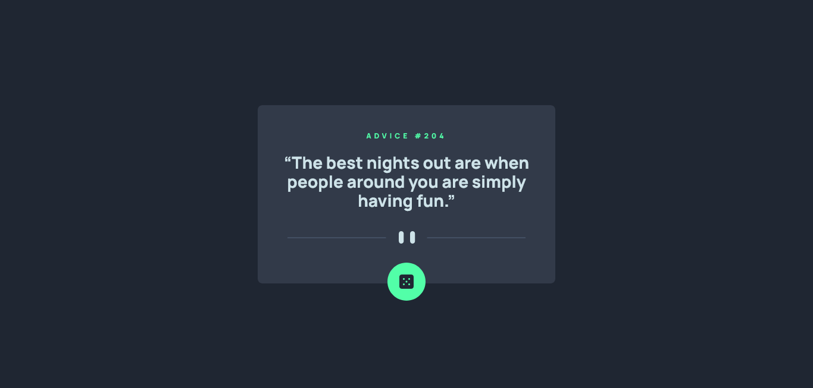

# Frontend Mentor - Advice generator app solution

This is a solution to the [Advice generator app challenge on Frontend Mentor](https://www.frontendmentor.io/challenges/advice-generator-app-QdUG-13db).

## Table of contents

- [Overview](#overview)
  - [The challenge](#the-challenge)
  - [Screenshot](#screenshot)
  - [Links](#links)
- [My process](#my-process)
  - [Built with](#built-with)
  - [What I learned](#what-i-learned)
- [Author](#author)

## Overview

### The challenge

Users should be able to:

- View the optimal layout for the app depending on their device's screen size
- See hover states for all interactive elements on the page
- Generate a new piece of advice by clicking the dice icon

### Screenshot



Screenshot of the desktop view.

### Links

- Solution URL: [Solution URL here](https://www.frontendmentor.io/solutions/advice-generator-app-_IubDBrwQR)
- Live Site URL: [Live site URL here](https://lisquote.netlify.app/)

## My process

### Built with

- Semantic HTML5 markup
- Tailwindcss
- Little CSS
- Flexbox
- Mobile-first workflow
- [React](https://reactjs.org/) - JS library
- [Next.js](https://nextjs.org/) - React framework
- [Tailwindcss](https://tailwindcss.com/) - For styles


### What I learned
- I learn't how to use Nextjs to fetch and update requests
- Creating the dice to be divided in the middle was indeed a challenge, I took a some time to brainstorm it out

```js

{advice?.slip.advice.length >= 88 ? (
          <p className="text-[#cee3e9]  text-[24px] font-extrabold text-center px-6 md:px-10 w-full h-[200px] sm:h-[100px] md:leading-8 ">
            “{advice?.slip.advice}”
          </p>
        ) : (
          <p className="text-[#cee3e9]  text-[28px] font-extrabold text-center px-6 md:px-10 w-full h-[200px] sm:h-[100px] md:leading-8 ">
            “{advice?.slip.advice}”
          </p>
        )}
}
```


## Author

- Website - [Muyonjo Solomon](https://github.com/Mu-Solomon/)
- Frontend Mentor - [@Mu-Solomon](https://www.frontendmentor.io/profile/Mu-Solomon)
- Twitter - [@SolomonMuyonjo](https://twitter.com/SolomonMuyonjo)
